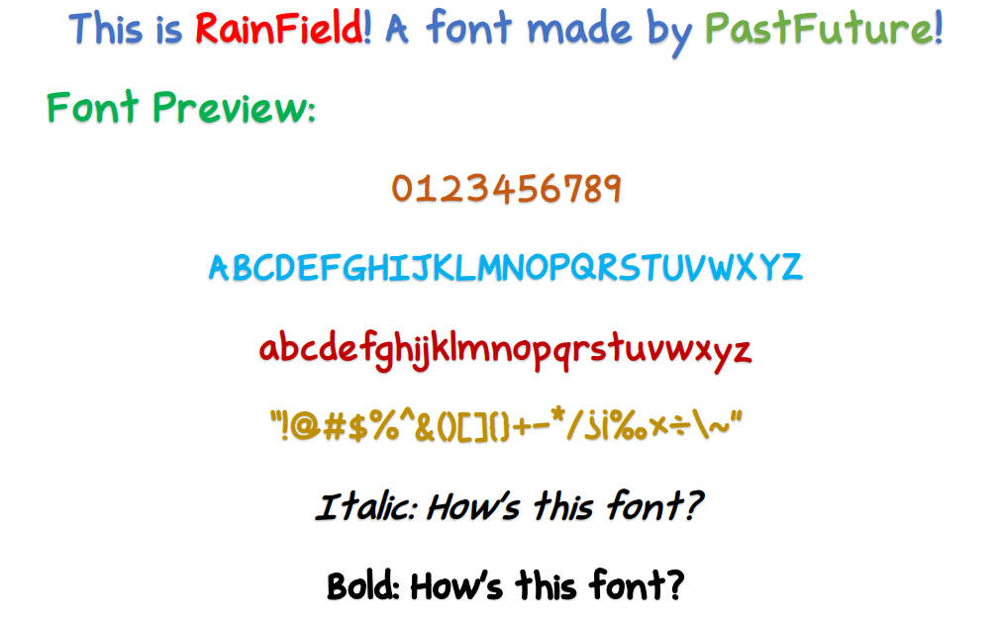

# RainField
An English Font created by PastFuture.

## 簡介 / Introduction

RainField 是由 [PastFuture](https://github.com/pastfuture777) 所製作。
本字體採用了[AdobeAI](https://www.adobe.com/products/illustrator.html)、[FontSelf](https://www.fontself.com/) 與 [BirdFont](https://birdfont.org/) 製作。

RainField is a font hand-written by [PastFuture](https://github.com/pastfuture777).
This project is finished by using the following websites or apps: [AdobeAI](https://www.adobe.com/products/illustrator.html)、[FontSelf](https://www.fontself.com/) and [BirdFont](https://birdfont.org/).

## 最新版本與下載方式 / Newest Version and Download Method

目前為初發預覽版！
請點選本頁面右側「[Releases](https://github.com/pastfuture777/RainField/releases)」處的最新發行版本，下載 RainField.ttf。安裝 .ttf 字型檔案即可使用。

This is the First Release Preview version of RainField.
Please click [Releases](https://github.com/pastfuture777/RainField/releases) and choose the newest version of RainField.ttf, download and install it. 

## 收錄字元 / Contained Characters

* 含有基本之英文26字大小寫。
* 含有基本數字與標點。

* Contained basic English characters.
* Contained basic Mathematical characters.
